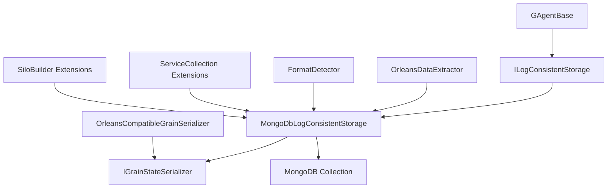

# MongoDB EventSourcing 开发者指南

## 架构概述

MongoDB EventSourcing实现基于Orleans的事件溯源模式，提供了与Orleans原生EventSourcing的兼容性，同时支持MongoDB作为持久化存储。

### 核心组件



## 核心接口

### ILogConsistentStorage

```csharp
public interface ILogConsistentStorage
{
    Task<IReadOnlyList<TLogEntry>> ReadAsync<TLogEntry>(
        string grainTypeName, GrainId grainId, int fromVersion, int maxCount);
    
    Task<int> GetLastVersionAsync(string grainTypeName, GrainId grainId);
    
    Task<int> AppendAsync<TLogEntry>(
        string grainTypeName, GrainId grainId, IList<TLogEntry> entries, int expectedVersion);
}
```

### IGrainStateSerializer

```csharp
public interface IGrainStateSerializer
{
    BsonValue Serialize<T>(T state);
    T Deserialize<T>(BsonValue value);
}
```

## 存储格式设计

### MongoDB文档结构

```csharp
public class EventDocument
{
    [BsonId]
    public ObjectId Id { get; set; }
    
    [BsonElement("GrainId")]
    public string GrainId { get; set; }
    
    [BsonElement("Version")]
    public int Version { get; set; }
    
    [BsonElement("snapshot")]
    public BsonDocument Data { get; set; }
    
    [BsonElement("Timestamp")]
    public DateTime Timestamp { get; set; } = DateTime.UtcNow;
}
```

### 集合命名策略

```csharp
private string GetStreamName(GrainId grainId)
{
    return $"{_serviceId}/{_name}/log/{grainId.Type}";
}
```

## 兼容性实现

### Orleans LogStateWithMetaData 检测

```csharp
public static bool IsOrleansLogStateWithMetaData(string jsonData)
{
    try
    {
        using var document = JsonDocument.Parse(jsonData);
        var root = document.RootElement;
        
        return root.TryGetProperty("__type", out var typeElement) &&
               typeElement.GetString()?.Contains("LogStateWithMetaData") == true &&
               root.TryGetProperty("Log", out var logElement) &&
               logElement.TryGetProperty("__values", out _) &&
               root.TryGetProperty("GlobalVersion", out _);
    }
    catch
    {
        return false;
    }
}
```

### 事件提取逻辑

```csharp
private List<TLogEntry> ExtractEventsFromOrleansData<TLogEntry>(string jsonData)
{
    var events = new List<TLogEntry>();
    
    using var document = JsonDocument.Parse(jsonData);
    var root = document.RootElement;
    
    if (root.TryGetProperty("Log", out var logElement) &&
        logElement.TryGetProperty("__values", out var valuesElement) &&
        valuesElement.ValueKind == JsonValueKind.Array)
    {
        foreach (var eventElement in valuesElement.EnumerateArray())
        {
            try
            {
                var eventJson = eventElement.GetRawText();
                var logEntry = JsonSerializer.Deserialize<TLogEntry>(eventJson)!;
                events.Add(logEntry);
            }
            catch (Exception ex)
            {
                _logger.LogWarning(ex, "Failed to deserialize event from Orleans LogStateWithMetaData");
            }
        }
    }
    
    return events;
}
```

## 序列化器实现

### 多格式序列化器

```csharp
public class OrleansCompatibleGrainSerializer : IGrainStateSerializer
{
    public T Deserialize<T>(BsonValue value)
    {
        if (value == null || value.IsBsonNull)
            return default(T)!;

        // MongoDB native format (BSON document)
        if (value.IsBsonDocument)
        {
            return BsonSerializer.Deserialize<T>(value.AsBsonDocument);
        }

        // JSON string format (Memory storage or Orleans serialization)
        if (value.IsString)
        {
            var jsonString = value.AsString;
            return DeserializeFromJson<T>(jsonString);
        }

        throw new InvalidOperationException(
            $"Unable to deserialize value of type {value.BsonType} to {typeof(T).Name}");
    }

    public BsonValue Serialize<T>(T state)
    {
        if (state == null)
            return BsonNull.Value;

        // Always serialize new data as BSON for optimal MongoDB performance
        return state.ToBsonDocument();
    }
}
```

## 迁移服务设计

### 建议的迁移服务接口

```csharp
public interface IFormatMigrationService
{
    Task<bool> MigrateAsync(GrainId grainId, StorageFormat from, StorageFormat to);
    Task<MigrationResult> ValidateMigrationAsync(GrainId grainId);
    Task<int> GetPendingMigrationsCountAsync();
}

public class MigrationResult
{
    public bool Success { get; set; }
    public string Error { get; set; }
    public int OriginalEventCount { get; set; }
    public int MigratedEventCount { get; set; }
    public TimeSpan Duration { get; set; }
}
```

### 迁移状态跟踪

```csharp
public class MigrationTracker
{
    private readonly IMongoCollection<MigrationRecord> _migrations;
    
    public async Task RecordMigrationAsync(GrainId grainId, MigrationResult result)
    {
        var record = new MigrationRecord
        {
            GrainId = grainId.ToString(),
            Timestamp = DateTime.UtcNow,
            Success = result.Success,
            Error = result.Error,
            Duration = result.Duration
        };
        
        await _migrations.InsertOneAsync(record);
    }
}
```

## 性能优化

### 索引策略

```csharp
public class IndexManager
{
    private readonly IMongoCollection<BsonDocument> _collection;
    
    public async Task CreateIndexesAsync()
    {
        var indexes = new[]
        {
            new CreateIndexModel<BsonDocument>(
                Builders<BsonDocument>.IndexKeys.Ascending("GrainId")),
            new CreateIndexModel<BsonDocument>(
                Builders<BsonDocument>.IndexKeys.Ascending("GrainId").Ascending("Version")),
            new CreateIndexModel<BsonDocument>(
                Builders<BsonDocument>.IndexKeys.Ascending("Version")),
            new CreateIndexModel<BsonDocument>(
                Builders<BsonDocument>.IndexKeys.Ascending("Timestamp"))
        };
        
        await _collection.Indexes.CreateManyAsync(indexes);
    }
}
```

### 连接池配置

```csharp
public static MongoClientSettings GetOptimalSettings()
{
    return new MongoClientSettings
    {
        MaxConnectionPoolSize = 100,
        MinConnectionPoolSize = 10,
        MaxConnectionIdleTime = TimeSpan.FromMinutes(30),
        ServerSelectionTimeout = TimeSpan.FromSeconds(30),
        ConnectTimeout = TimeSpan.FromSeconds(30),
        SocketTimeout = TimeSpan.FromSeconds(30),
        ReadPreference = ReadPreference.SecondaryPreferred,
        WriteConcern = WriteConcern.WMajority,
        ReadConcern = ReadConcern.Majority
    };
}
```

## 监控和诊断

### 性能计数器

```csharp
public class EventSourcingMetrics
{
    private readonly IMetricsLogger _metrics;
    
    public void RecordReadOperation(TimeSpan duration, int eventCount)
    {
        _metrics.Gauge("eventsourcing.read.duration", duration.TotalMilliseconds);
        _metrics.Gauge("eventsourcing.read.events", eventCount);
    }
    
    public void RecordWriteOperation(TimeSpan duration, int eventCount)
    {
        _metrics.Gauge("eventsourcing.write.duration", duration.TotalMilliseconds);
        _metrics.Gauge("eventsourcing.write.events", eventCount);
    }
    
    public void RecordMigration(bool success, TimeSpan duration)
    {
        _metrics.Counter("eventsourcing.migration.total");
        if (success)
            _metrics.Counter("eventsourcing.migration.success");
        else
            _metrics.Counter("eventsourcing.migration.failed");
            
        _metrics.Gauge("eventsourcing.migration.duration", duration.TotalMilliseconds);
    }
}
```

### 健康检查

```csharp
public class EventSourcingHealthCheck : IHealthCheck
{
    private readonly MongoDbLogConsistentStorage _storage;
    
    public async Task<HealthCheckResult> CheckHealthAsync(
        HealthCheckContext context, 
        CancellationToken cancellationToken = default)
    {
        try
        {
            // 测试连接
            await _storage.GetLastVersionAsync("HealthCheck", GrainId.Parse("health-check"));
            
            // 检查挂起的迁移
            var pendingMigrations = await GetPendingMigrationsCountAsync();
            
            var data = new Dictionary<string, object>
            {
                ["pending_migrations"] = pendingMigrations,
                ["timestamp"] = DateTime.UtcNow
            };
            
            return pendingMigrations > 1000 
                ? HealthCheckResult.Degraded("High number of pending migrations", data: data)
                : HealthCheckResult.Healthy("EventSourcing is healthy", data: data);
        }
        catch (Exception ex)
        {
            return HealthCheckResult.Unhealthy("EventSourcing is unhealthy", ex);
        }
    }
}
```

## 测试策略

### 单元测试

```csharp
public class MongoDbLogConsistentStorageTests
{
    private readonly MongoDbLogConsistentStorage _storage;
    private readonly Mock<ILogger<MongoDbLogConsistentStorage>> _logger;
    
    [Fact]
    public async Task ReadAsync_OrleansFormat_ShouldExtractEventsCorrectly()
    {
        // Arrange
        var grainId = GrainId.Parse("test-grain");
        var orleansData = CreateOrleansFormatData();
        
        // Act
        var events = await _storage.ReadAsync<TestEvent>("TestGrain", grainId, 0, 100);
        
        // Assert
        Assert.Equal(2, events.Count);
        Assert.Equal("Event1", events[0].Name);
        Assert.Equal("Event2", events[1].Name);
    }
    
    [Fact]
    public async Task AppendAsync_ShouldCreateMongoDbFormatDocuments()
    {
        // Arrange
        var grainId = GrainId.Parse("test-grain");
        var events = new[] { new TestEvent { Name = "Test" } };
        
        // Act
        var version = await _storage.AppendAsync("TestGrain", grainId, events, 0);
        
        // Assert
        Assert.Equal(1, version);
        
        var documents = await GetDocumentsAsync(grainId);
        Assert.Single(documents);
        Assert.Equal("test-grain", documents[0]["GrainId"].AsString);
    }
}
```

### 集成测试

```csharp
public class EventSourcingIntegrationTests : IClassFixture<MongoDbTestFixture>
{
    private readonly MongoDbTestFixture _fixture;
    
    public EventSourcingIntegrationTests(MongoDbTestFixture fixture)
    {
        _fixture = fixture;
    }
    
    [Fact]
    public async Task EndToEnd_OrleansToMongoDB_Migration()
    {
        // Arrange
        var grain = _fixture.Cluster.GrainFactory.GetGrain<ITestGrain>(Guid.NewGuid());
        
        // Act - 写入Orleans格式数据
        await grain.AddEventAsync(new TestEvent { Name = "Orleans Event" });
        
        // 触发迁移
        await grain.GetEventsAsync();
        
        // Assert - 验证MongoDB格式
        var mongoDbEvents = await _fixture.GetEventsFromMongoDbAsync(grain.GetGrainId());
        Assert.Single(mongoDbEvents);
        Assert.Equal("Orleans Event", mongoDbEvents[0].Name);
    }
}
```

## 扩展点

### 自定义序列化器

```csharp
public class CustomGrainSerializer : IGrainStateSerializer
{
    public BsonValue Serialize<T>(T state)
    {
        // 自定义序列化逻辑
        return CustomBsonSerializer.Serialize(state);
    }
    
    public T Deserialize<T>(BsonValue value)
    {
        // 自定义反序列化逻辑
        return CustomBsonSerializer.Deserialize<T>(value);
    }
}
```

### 自定义集合命名策略

```csharp
public interface ICollectionNameStrategy
{
    string GetCollectionName(GrainId grainId, string serviceName);
}

public class TypeBasedCollectionNameStrategy : ICollectionNameStrategy
{
    public string GetCollectionName(GrainId grainId, string serviceName)
    {
        return $"{serviceName}_events_{grainId.Type}";
    }
}
```

## 部署建议

### 生产环境配置

```csharp
// appsettings.Production.json
{
    "MongoDB": {
        "ConnectionString": "mongodb://mongo1:27017,mongo2:27017,mongo3:27017/eventsourcing?replicaSet=rs0",
        "Database": "EventSourcing",
        "Settings": {
            "ReadPreference": "SecondaryPreferred",
            "WriteConcern": "WMajority",
            "ReadConcern": "Majority",
            "MaxConnectionPoolSize": 100
        }
    }
}
```

### 监控配置

```csharp
services.AddHealthChecks()
    .AddCheck<EventSourcingHealthCheck>("eventsourcing")
    .AddCheck<MongoDbHealthCheck>("mongodb");

services.AddMetrics()
    .AddEventSourcingMetrics();
```

## 故障排除

### 常见问题诊断

1. **连接问题**
   - 检查MongoDB连接字符串
   - 验证网络连接
   - 检查认证凭据

2. **序列化问题**
   - 检查类型兼容性
   - 验证BSON序列化器注册
   - 检查JSON格式

3. **迁移问题**
   - 检查迁移日志
   - 验证数据完整性
   - 检查并发访问

### 调试工具

```csharp
public class EventSourcingDebugger
{
    public async Task DiagnoseGrainAsync(GrainId grainId)
    {
        var documents = await GetAllDocumentsAsync(grainId);
        
        foreach (var doc in documents)
        {
            Console.WriteLine($"Document: {doc.ToJson()}");
            Console.WriteLine($"Format: {DetectFormat(doc)}");
            Console.WriteLine($"Version: {doc.GetValue("Version", "N/A")}");
            Console.WriteLine("---");
        }
    }
}
```

## 最佳实践

1. **架构设计**
   - 保持关注点分离
   - 使用依赖注入
   - 实现适当的抽象层

2. **性能优化**
   - 创建适当的索引
   - 配置连接池
   - 使用批量操作

3. **可靠性**
   - 实现重试机制
   - 添加健康检查
   - 监控关键指标

4. **可维护性**
   - 编写单元测试
   - 提供详细日志
   - 文档化配置选项 